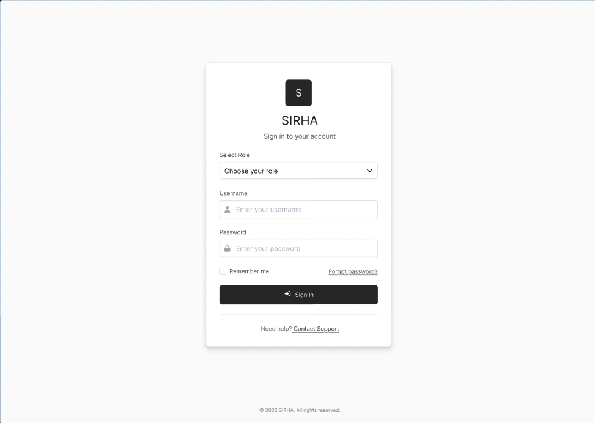
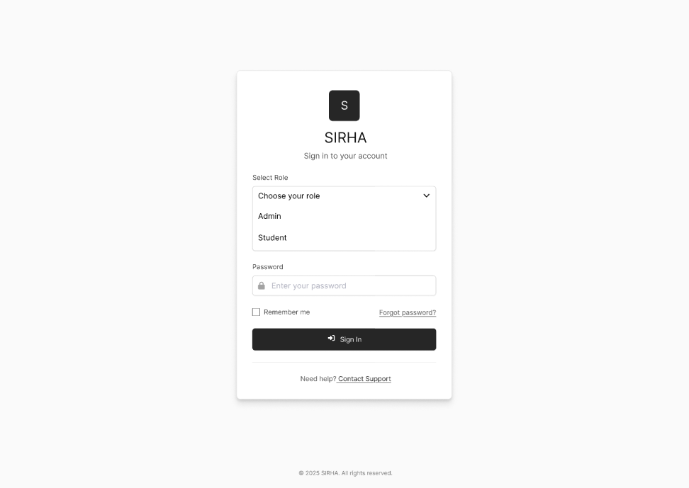
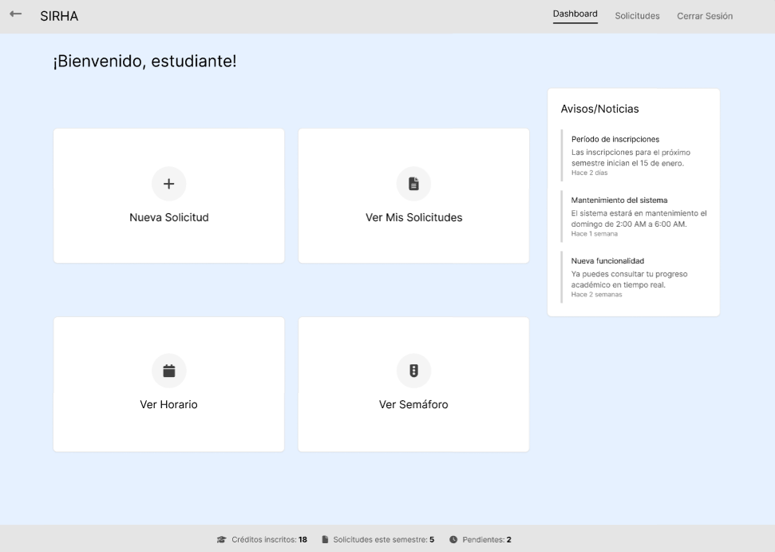
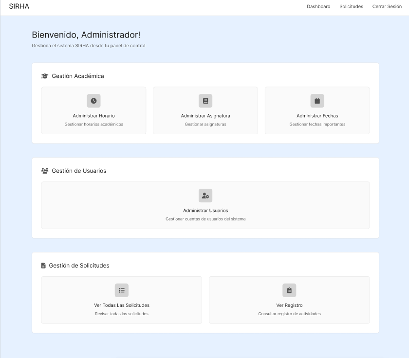
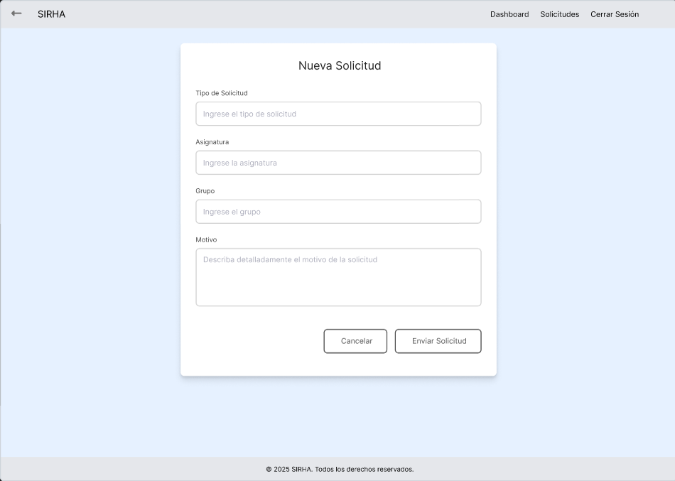
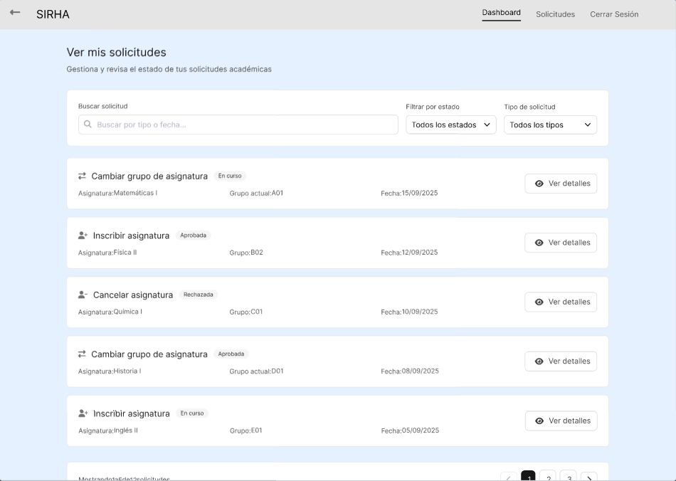
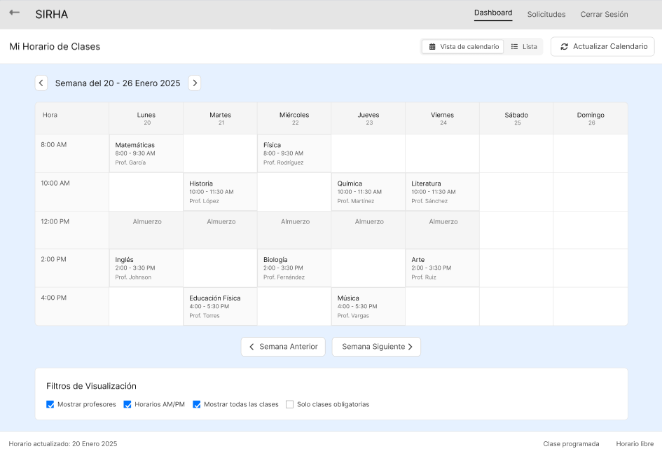
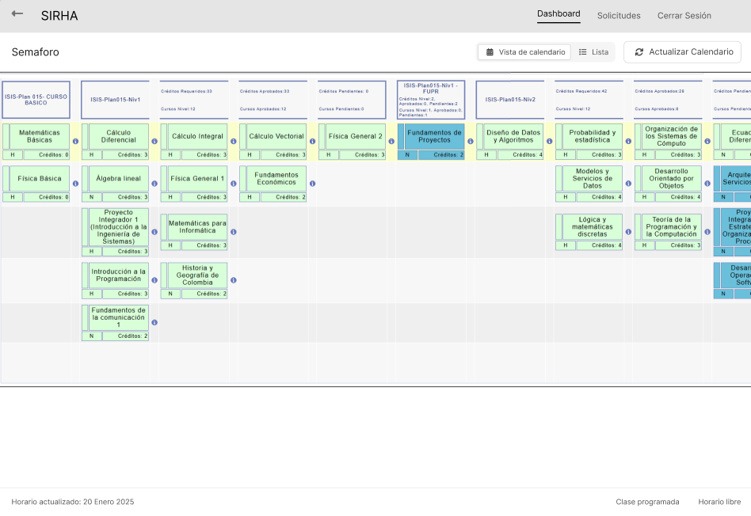
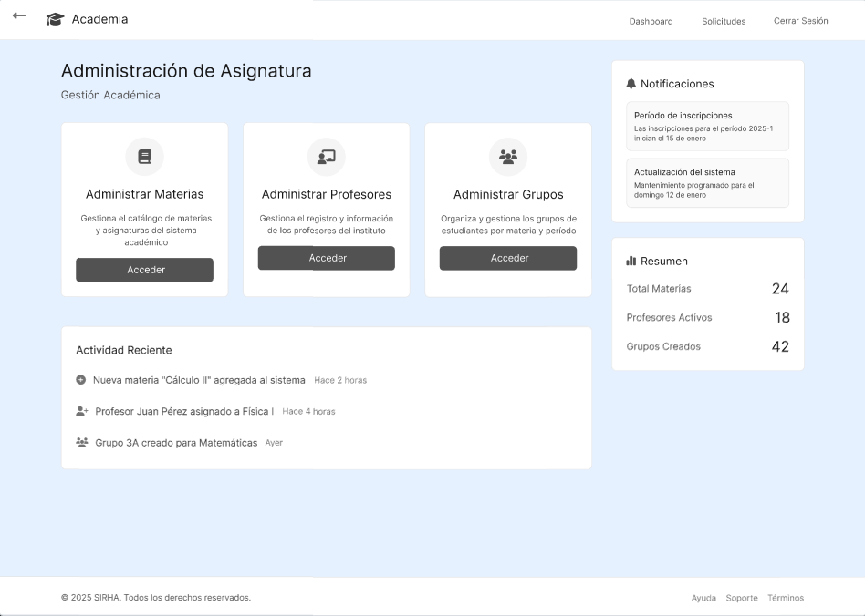
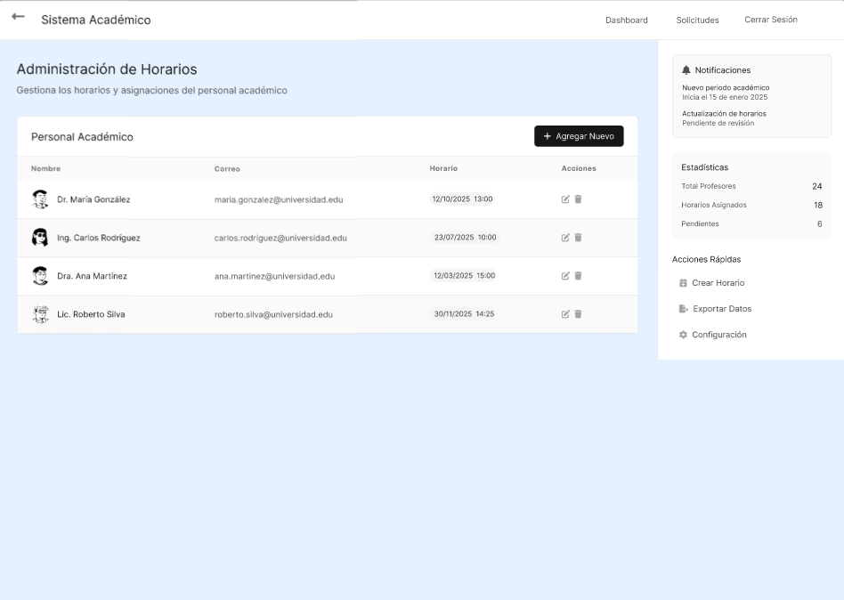

# PROFESORSUPERO-FRONT
# PROFESORSUPERO-FRONT - FrontEnd

## Descripción
Este repositorio contiene el prototipo visual (FrontEnd).  
Se desarrolla como soporte al BackEnd (Spring Boot + MongoDB).

---

## Prototipo de Bajo Nivel (Mockups)

Los siguientes pantallazos corresponden al prototipo elaborado en Figma.  
Se incluyen para ilustrar la estructura inicial de la interfaz de usuario.

### Iniciar sesion

### Sesion estudiante

### Sesion administrador

### Crear solicitud

### Ver solicitudes

### Ver horario

### Ver semaforo

### Administrar asignatura

## Administrar horarios

Los archivos fuente del prototipo se encuentran en Figma, y aquí se documentan mediante imágenes.

https://www.figma.com/design/Mc7HWn9QLE4IM543NLuMMm/mockups-SIRHA?node-id=0-1&t=PfHQv5itbRaoEREw-1

---

## Estrategia de Versionamiento y Branches

- `main`: rama principal, prototipo estable.  
- `develop`: rama de desarrollo.  
- `feature/*`: creación de nuevas vistas o componentes.  
- `bugfix/*`: corrección de errores.  

---

## Autores
- Sebastián Barros
- Nicolas Duarte
- Julián Ramirez
- Juan Rangel
- Santiago Suarez  

