# PROFESORSUPERO-FRONT
# PROFESORSUPERO-FRONT - FrontEnd

## Descripción
Este repositorio contiene el prototipo visual (FrontEnd).  
Se desarrolla como soporte al BackEnd (Spring Boot + MongoDB).

---

## Prototipo de Bajo Nivel (Mockups)

Los siguientes pantallazos corresponden al prototipo elaborado en Figma.  
Se incluyen para ilustrar la estructura inicial de la interfaz de usuario.

### Iniciar sesion
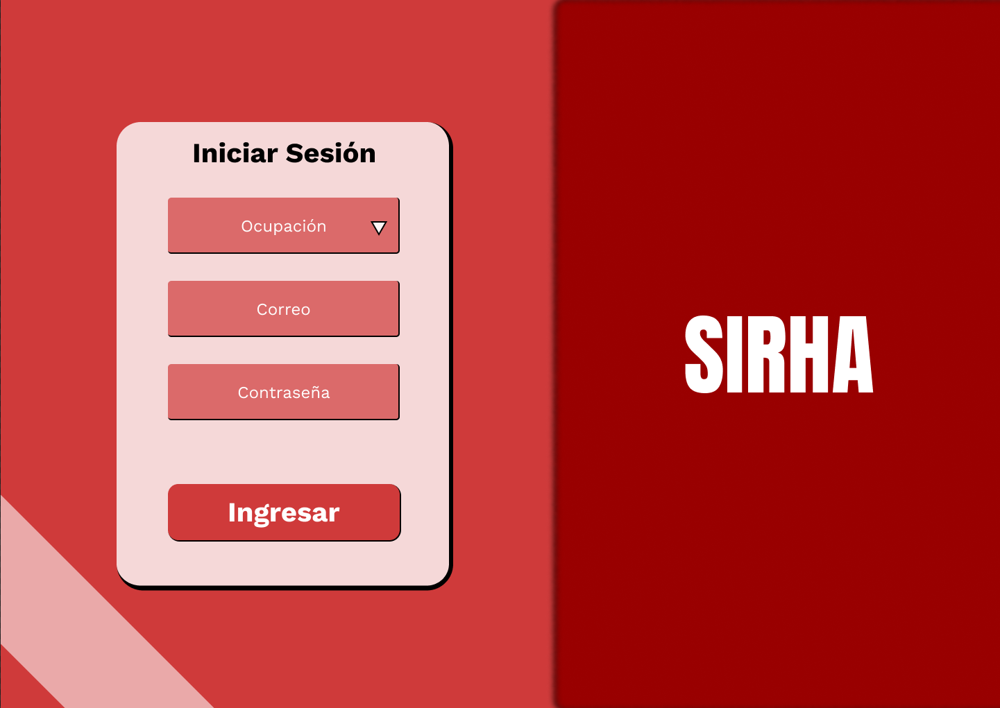

### Sesion estudiante
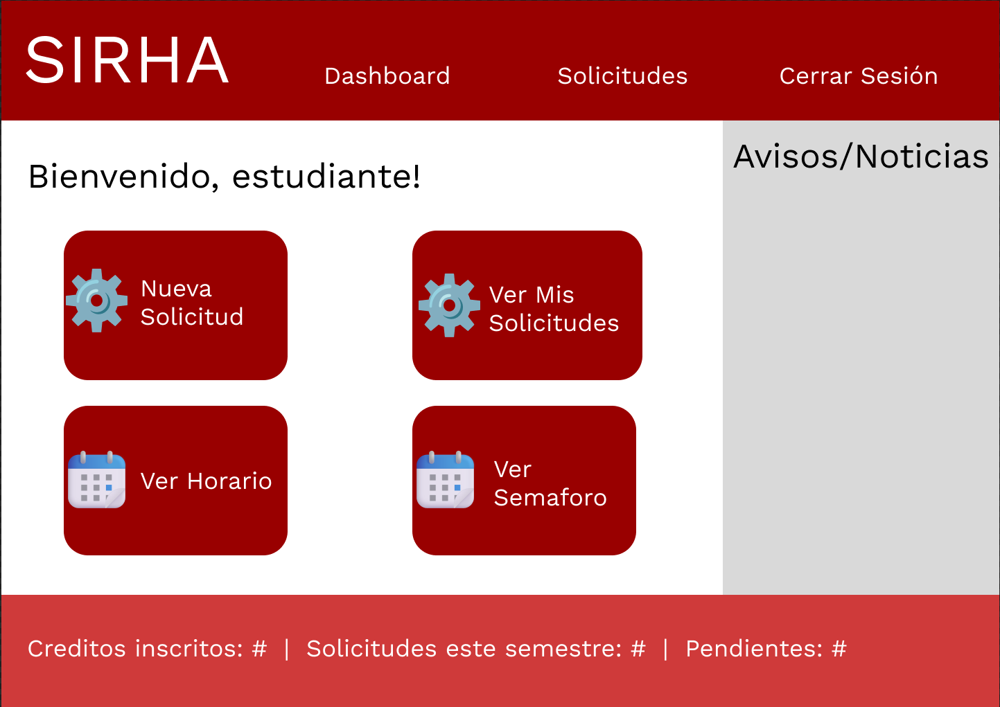

### Sesion decano
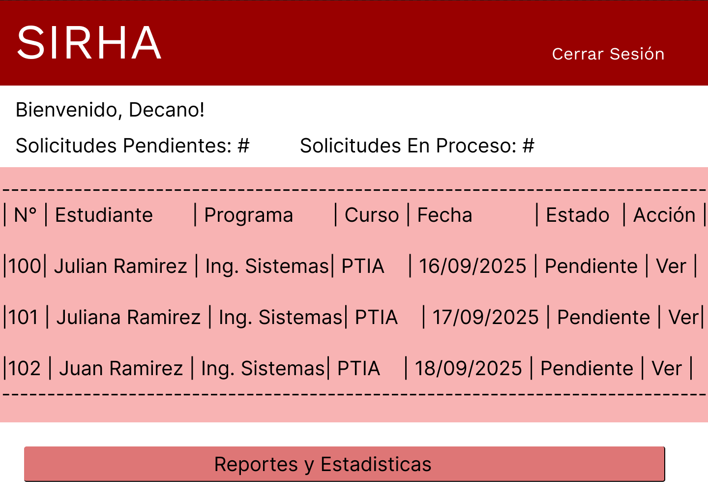

### Informacion de solicitud
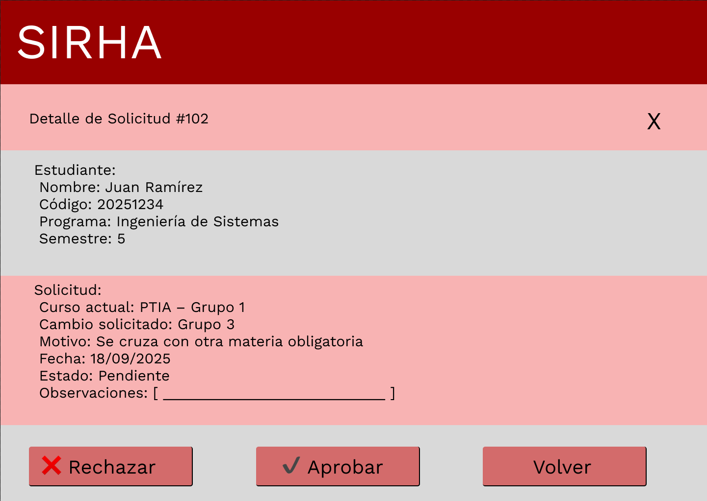

### Crear solicitud
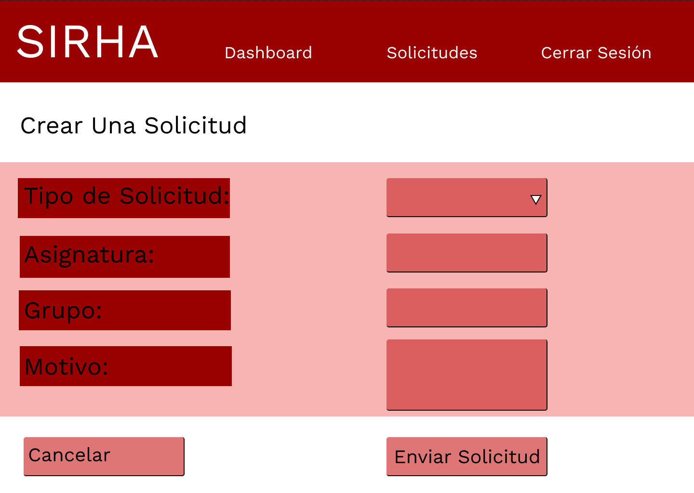

### Sesion administrador
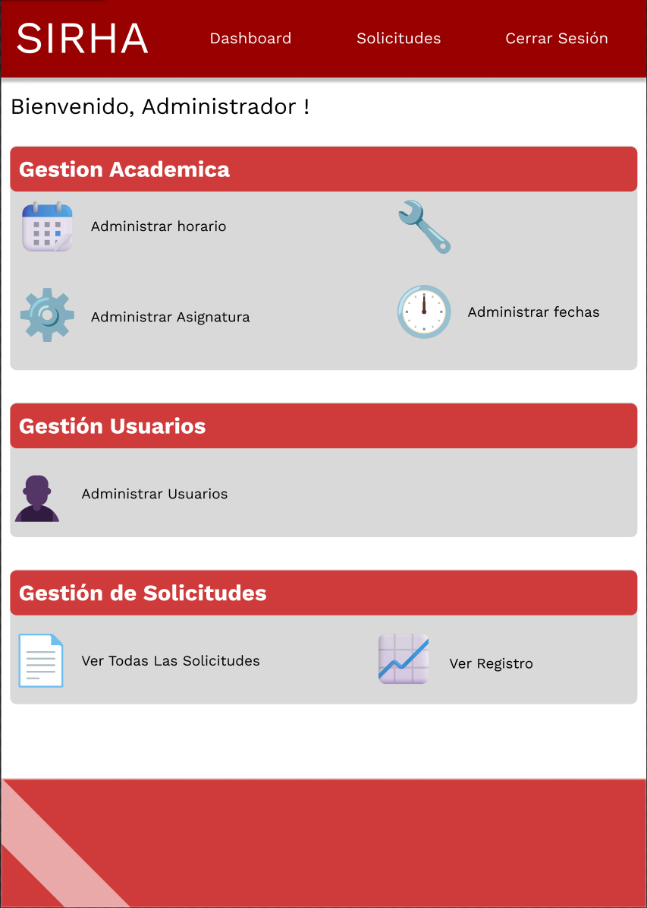

### Administrar asignatura
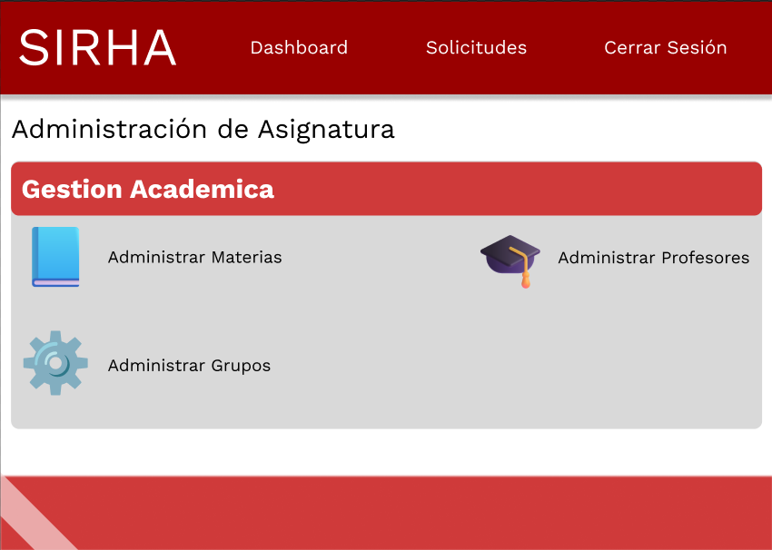

### Administrar horarios
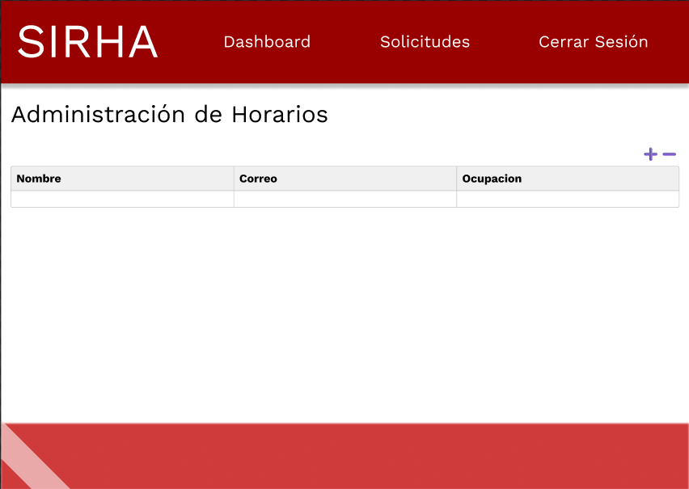

### Administrar grupos
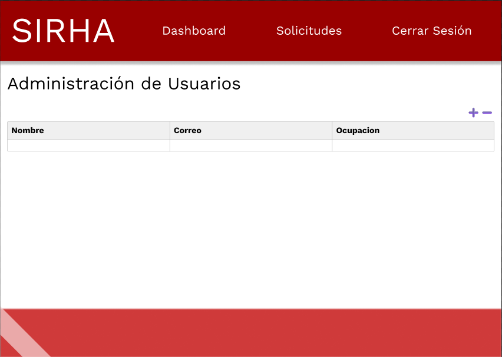

### Administrar profesores
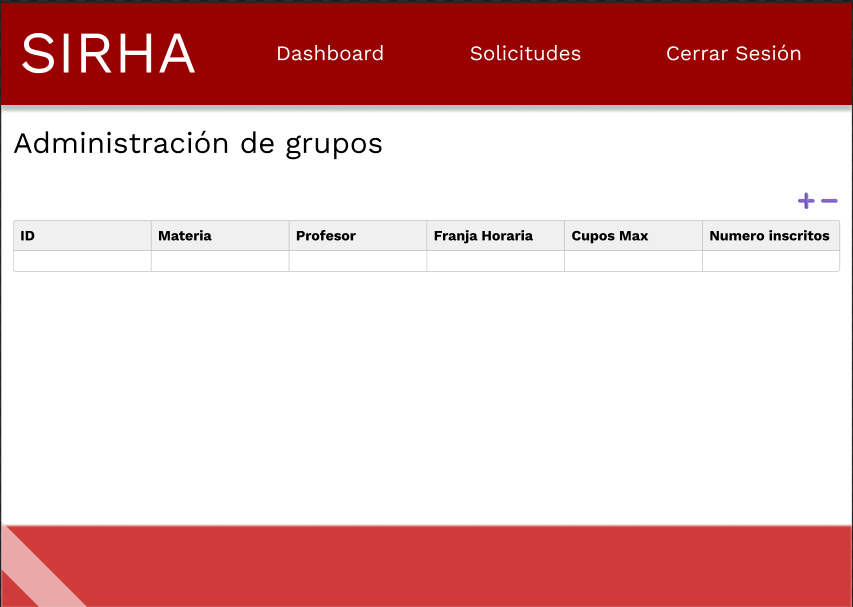

### Administrar materias
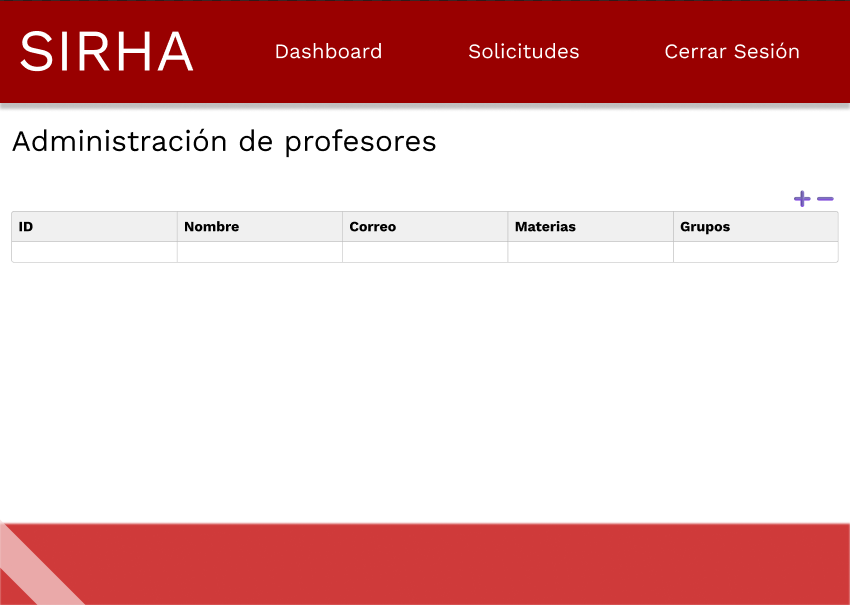

Los archivos fuente del prototipo se encuentran en Figma, y aquí se documentan mediante imágenes.

https://www.figma.com/design/1Nz6BQJcoVEMoVQmsHt7AY/Sin-t%C3%ADtulo?node-id=0-1&t=V0tE7SqwgQnL9BfJ-1

---

## Estrategia de Versionamiento y Branches

- `main`: rama principal, prototipo estable.  
- `develop`: rama de desarrollo.  
- `feature/*`: creación de nuevas vistas o componentes.  
- `bugfix/*`: corrección de errores.  

---

## Autores
- Sebastian Barrios
- Nicolas Duarte
- Julian Ramirez
- Juan Rangel
- Santiago Suarez  

